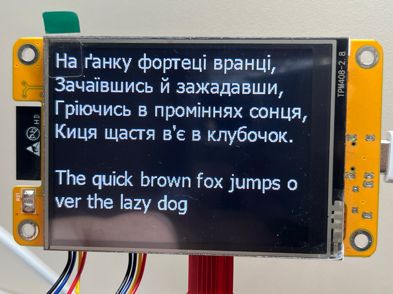
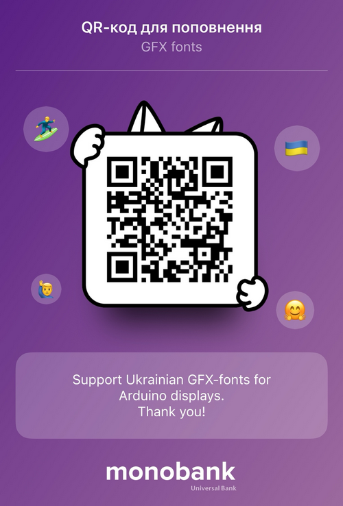

# Ukr_GFX_fonts

---

## 🇬🇧 English

**Ukr_GFX_fonts** is a collection of fonts with Ukrainian character support for GFX libraries (Adafruit GFX, Arduino GFX) and a helper function to convert UTF-8 strings with Ukrainian letters into font codes.

### Library Compatibility / Сумісність з бібліотеками

| Library                           | Compatibility | Notes                              |
|----------------------------------|---------------|------------------------------------|
| Adafruit GFX                      | ✅ Full       | Original format                     |
| Arduino_GFX_Library               | ✅ Full       | Recommended                         |
| TFT_eSPI                          | ⚙️ Partial    | Via `setFreeFont()`                 |
| LovyanGFX                         | ⚙️ Partial    | Via `setFont(const GFXfont*)`      |
| GxEPD / GxEPD2                     | ✅ Full       | E-Ink displays                       |
| Adafruit_ST7735, ILI9341, SSD1306 | ✅ Full       | Subset of GFX                       |

### Library Contents

- **Fonts** (`.h` files are in `src/fonts/`):

| Serif        | Sans-Serif     | Monospace    |
|-------------|----------------|--------------|
| Cambria     | Constant       | Consola      |
|             | Segoe UI       | Lucon        |
|             | Tahoma         | Micross      |
|             | Verdana        |              |

> **Note 1:** Suffixes `i`, `b`, or `z` in a font file name indicate **italic**, **bold**, or **italic bold** style.  
> **Note 2:** The number in the font file name indicates the **font size**.  
> **Note 3:** At small font sizes, minor visual artifacts may appear. You can adjust fonts using online tools like the [Adafruit GFX Pixel Font Customiser](https://oleddisplay.squix.ch/#/home).


- **Conversion function**:  
  - `Utf8win1251(const char* source)` — converts a UTF-8 string into font codes using a replacement table.  
  - Used to display Ukrainian letters via GFX.

### Usage

Example of including the library and font:

```cpp
#include <Arduino_GFX_Library.h>
#include <utils.h>
#include <tahomaUkr12.h> // desired font
```

Example of printing Ukrainian text:

```cpp
String msg = "Привіт Ґ!";
gfx->setFont(&tahomaUkr12);
gfx->setCursor(0, 20);
gfx->print(String(Utf8win1251(msg.c_str())));
```

### Demo Sketch

The example sketch `examples/TestFonts/TestFonts.ino` demonstrates displaying Ukrainian text on the screen.

Below is a screenshot of the sketch running on an **ESP32 Cheap Yellow Display**:



*Screenshot of the demo running on an ESP32 Cheap Yellow Display.*

### Support

If you find this project useful and want to support its development, you can donate via one of the following ways:

- **PayPal**: [gia@gia.org.ua] [Donate via PayPal](https://www.paypal.me)  
- **Ko-fi**: [Donate on Ko-fi](https://ko-fi.com/igorgimelfarb)  
- **Monobank**: Scan the QR code or use the link: [Donate via Monobank](https://send.monobank.ua/jar/8d9QXHvrNa)



**Your support is greatly appreciated!**

### License

MIT License — free to use, modify, and distribute. See `LICENSE` for details.  

---

## 🇺🇦 Українська

**Ukr_GFX_fonts** — це колекція шрифтів з підтримкою українських букв для бібліотек GFX (Adafruit GFX, Arduino GFX) та допоміжна функція для перетворення UTF-8 рядків з українськими символами у коди шрифтів.

### Сумісність з бібліотеками

| Бібліотека                        | Сумісність    | Примітка                            |
| --------------------------------- | ------------- | ---------------------------------- |
| Adafruit GFX                      | ✅ Повна      | Оригінальний формат                 |
| Arduino_GFX_Library               | ✅ Повна      | Рекомендована                       |
| TFT_eSPI                          | ⚙️ Часткова   | Через `setFreeFont()`               |
| LovyanGFX                         | ⚙️ Часткова   | Через `setFont(const GFXfont*)`    |
| GxEPD / GxEPD2                     | ✅ Повна      | E-Ink дисплеї                        |
| Adafruit_ST7735, ILI9341, SSD1306 | ✅ Повна      | Підмножина GFX                      |

### Вміст бібліотеки

- **Шрифти** (файли `.h` знаходяться в `src/fonts/`):

| З засічками (Serif) | Без засічок (Sans-Serif) | Моноширинні (Monospace) |
|--------------------|--------------------------|-------------------------|
| Cambria            | Constant                 | Consola                 |
|                    | Segoe UI                 | Lucon                   |
|                    | Tahoma                   | Micross                 |
|                    | Verdana                  |                         |

> **Примітка 1:** Суфікси `i`, `b` або `z` у назві файлу шрифту означають **italic**, **bold** або **italic bold** стиль.  
> **Примітка 2:** Цифра в назві файлу шрифту означає **розмір шрифту**.  
> **Примітка 3:** На малих розмірах шрифтів можуть з’являтися невеликі артефакти. Ви можете підправити шрифти на свій смак, використовуючи онлайн-інструменти, такі як [Adafruit GFX Pixel Font Customiser](https://oleddisplay.squix.ch/#/home).


- **Функція перетворення**:  
  - `Utf8win1251(const char* source)` — перетворює UTF-8 рядок у коди шрифта, використовуючи таблицю замін.  
  - Використовується для відображення українських символів через GFX.

### Підключення

Приклад підключення бібліотеки та шрифту:

```cpp
#include <Arduino_GFX_Library.h>
#include <utils.h>
#include <tahomaUkr12.h> // потрібний шрифт
```

### Використання

Приклад виклику функції `utf8rus2` для виводу тексту на дисплей:

```cpp
String msg = "Привіт Ґ!";
gfx->setFont(&tahomaUkr12);
gfx->setCursor(0, 20);
gfx->print(String(Utf8win1251(msg.c_str())));
```

### Приклад

Скетч `examples/TestFonts/TestFonts.ino` демонструє вивід українського тексту на дисплей.

Нижче наведено скріншот роботи скетчу на **ESP32 Cheap Yellow Display**:


*Скріншот роботи прикладу на ESP32 Cheap Yellow Display.*


### Підтримка


Якщо ви вважаєте цей проект корисним і хочете підтримати його розробку, ви можете зробити пожертву будь-яким із наступних способів:

- **PayPal**: [gia@gia.org.ua] [Donate via PayPal](https://www.paypal.me)  
- **Ko-fi**: [Donate on Ko-fi](https://ko-fi.com/igorgimelfarb)  
- **Monobank**: Відскануйте QR-код або скористайтеся посиланням: [Пожертвувати через Monobank](https://send.monobank.ua/jar/8d9QXHvrNa)


**Ваша підтримка буде дуже цінною!**

### Ліцензія

MIT License — вільне використання, модифікація та розповсюдження. Детальніше у файлі `LICENSE`.

## Keywords

Ukrainian, GFX, Adafruit, Arduino, fonts, UTF-8, display, text, Tahoma, Cambria, Constant, Segoe UI, Verdana, Consola, Lucon, Micross, Adafruit GFX, Arduino_GFX_Library, TFT_eSPI, LovyanGFX, GxEPD, E-Ink, embedded, microcontroller, ESP32, OLED, LCD, text rendering, pixel font
